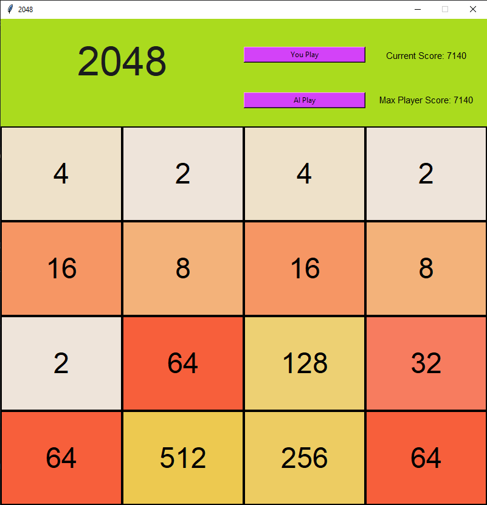
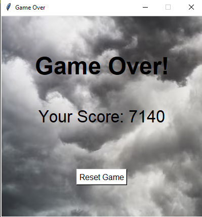

# 2048 

## The Team

#### Jakin Chan 
- [x] GitHub: https://github.com/JakinChan200

#### Nathan Kong
- [x] GitHub: https://github.com/NathanKong06

#### Shruti Jawale:
- [x] GitHub: https://github.com/shjawale


## Overview
This is a Python application based off of the popular online minigame "2048" where one tries to achieve the 2048 tile through combining smaller tiles. There are two ways of playing the game, either you play or the bot plays.
The game starts with 2 tiles, either a 2 tile or a 4 tile, spawning another 2 or 4 tile after every move.
The goal is to maximize the highest tile on the board by combining pairs of tiles left, right, up, and down.

## Tech Stack


## Images
Bot Playing:


Example Game Screen:



Game Over Screen:



## Usage
### Setup and Run:
1. Clone the repo
   ```sh
   git clone https://github.com/JakinChan200/2048.git
   ```
 
2. Compile the C++ code
    ```sh
    g++ -O4 -shared -o botLib.dll 2048.cpp -static -static-libgcc -static-libstdc++
    ```

4. Run
   ```sh
   python 2048.py
   ```

### Player Play Mode
1. Click `You Play` and use the &uarr; &darr; &larr; &rarr; keys to merge similar tiles. Try to get the 2048 tile!

### Bot Mode
1. Click `AI Play` and watch as it attempts to get the 2048 tile!
